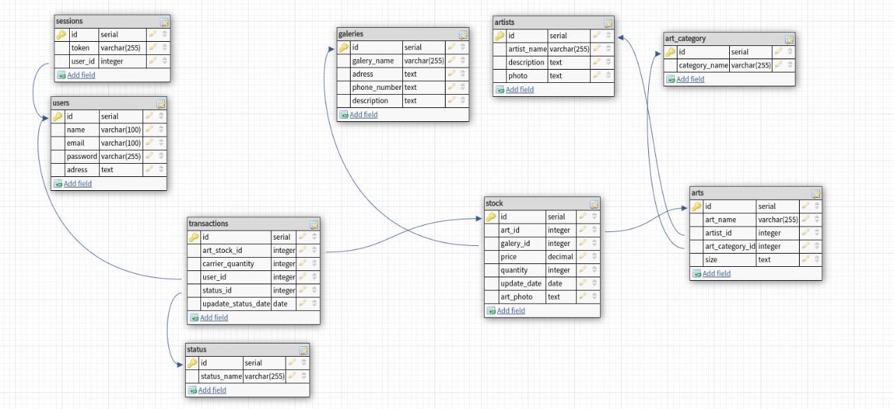

# Mira
## About this Project
Mira is an API that makes it possible to manage an e-commerce that sells art from different galleries.

## Why
My project partner and I realized that many people who love art don't know where to buy it. That's why we created this e-commerce.

We'll be happy if you can provide some feedback on the design, code, structure, or anything else you can report that might make us a better developer!
Email me: angelicacavalheiro51@gmail.com


## Database Layout

The database was designed at https://www.dbdesigner.net/ for PostgreSQL. <br/>

In your psql terminal
```
$ CREATE DATABASE mira_dev;
```
Access the database
```
$ \c mira_dev
```
Now, just run the commands listed in <a href="https://github.com/angelicacavalheiro/Mira">dump.sql</a>

---
## How it works
This project is divided into two parts:
1. Backend (This repository)
2. Frontend (You can find here: https://github.com/digdiego13/Mira_front)
---

## Some notes about this app
1 - We are still refactoring this project, so the architecture of some components may be different from other components.

2 - The address and payment features have been simplified in this project. So to use this API in real situations, these features need to be improved.

## Functionalities
SignIn and signUp with password and email validations;

Insert and list: artists, galleries, arts and arts categories;

Linking arts to different artists and galleries;

Insert the number of pieces available in stock for each art in each gallery;

Insert and delete products in the cart;

Prevent adding products to the cart without the user being logged in;

Review products added to cart;

Prevent the purchase of more items than is available in stock;

Checkout;

Logout.

## Installing

**Cloning the Repository**

```
$ git clone https://github.com/angelicacavalheiro/Mira
$ cd Mira
```

**Installing dependencies**

```
$ npm install
```

**Run the application in production mode**

```
$ ntl -> start
```
**Run the application in development mode**

Create a .env.dev file and fill it using your environment variables following the .env.example
You can find the .env.example [here](https://github.com/angelicacavalheiro/Mira/blob/main/.env.example).

```
$ ntl -> start:dev
```

In this case you need to adapt the routes that access the backend, on the front. 

##

## Built With
**Server**  ([NodeJS](https://nodejs.org/en/))
-   **[Express](https://expressjs.com/)**
-   **[CORS](https://expressjs.com/en/resources/middleware/cors.html)**
-   **[Bcrypt](https://github.com/kelektiv/node.bcrypt.js)**
-   **[NTL](https://github.com/ruyadorno/ntl)**
-   **[Pg](https://github.com/brianc/node-postgres)**
-   **[DotENV](https://github.com/motdotla/dotenv)**
-   **[UUID](https://github.com/uuidjs/uuid)**
-   **[Faker](https://github.com/Marak/Faker.js)**
-   **[Joi](https://github.com/hapijs/joi)**
-   **[Husky](https://github.com/typicode/husky)**
-   **[Jest](https://github.com/facebook/jest)**
-   **[Supertest](https://github.com/visionmedia/supertest)**
-   **[Eslint - Airbnb](https://github.com/airbnb/javascript)**
-   **[Prettier](https://github.com/prettier/prettier)**
##

## How to contribute
1. Fork the project.
2. Create a new branch with your changes: `git checkout -b feat/myFeatureName`
3. For each feature implemented, make a commit specifying what was done
4. Submit your changes: `git push -u origin feat/myFeatureName`

##

## Author
Developed by Angélica Cavalheiro Rodrigues e Diego Nogueira.
